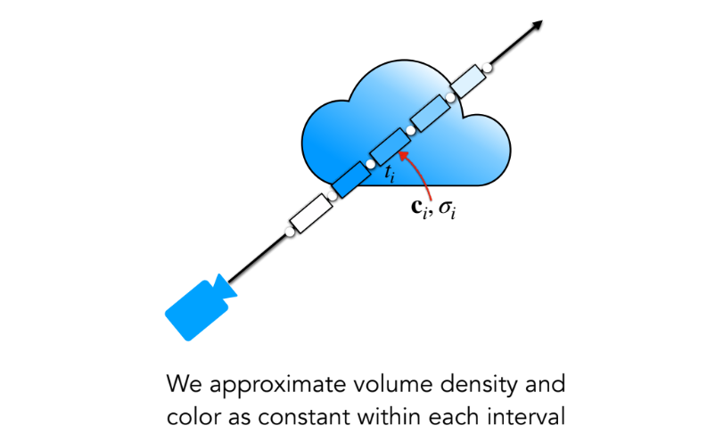
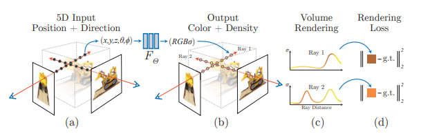
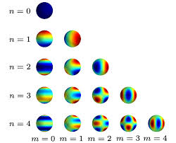
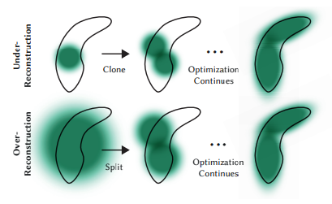

# Novel View Synthesis

The Battle of Paradigms: Neural Radiance Fields vs. 3D Gaussian Splatting

  
    Team Warm-White: Hanani Bathina | Aniket Hinge | Devesh Bajaj
  

---
layout: statement
---

# Goal

## Generate Realistic 3D Environments, allowing (real-time) navigation 

---
layout: section
---

# History

---
layout: default
---

# Physcially-based Rendering (PBR)
## Traditional approach to generate a 3D scene

**Key Steps:**

* Artists create geometry using triangular meshes

* Material is assigned to the geometry

* Cameras and Light sources are placed in the scene

* Rendering algorithms simulate light transport to give radiance to the geometry

---
layout: two-cols-header
---

# Real-World Capture & View Synthesis

::left::

## Ideal Scenario

If we had perfect geometry and camera pose estimation, we could have synthesized novel-view in this manner.

::right::

## Realistic Scenario

But, in practice, the geometry from vision is approximate and you don't have any information on material (or very hard to get)

---
layout: default
---

# Image-based Rendering (IBR)
## Bypass the need for explicit geometry and material modeling

**Key Techniques:**

* _**Light-Field Rendering**_ : Maintain a 4D light field representation and interpolate between views.

* _**View Morphing and Image Warping**_ : Use geometric transformations to morph between images.

---
layout: default
---

# Point-based Rendering
## Represent scenes using points instead of meshes

**Core Concept**:
PBR treats the scene as a dense cloud of unconnected 3D points. However, unlike meshes, it discards connectivity information (edges and faces).

**Key Techniques**:

-  **Splatting:** You cannot simply project a single dimensionless point onto a screen, or you will get a sparse image with gaps between pixels. PBR solves this via **Splatting**. Each point is treated as a small surface patch (often a disk or ellipse) called a **Surfel** (Surface Element). When rendered, these surfels are "splatted" onto the screen, overlapping each other to form a continuous surface

**Artifacts**: PBR struggled with **holes** (when you zoom in too close and the points spread apart) and **aliasing** (jagged edges). It also struggled with transparency and view-dependent effects (like reflections) because points usually hold a single fixed color.

---
layout: default
---

# SFM & MVS

**Structure from Motion (SfM)** & **Multi-View Stereo (MVS)**: automatic camera calibration and sparse/dense geometric reconstruction.

* **SfM** is a major breakthrough. It has a very useful side-product: A set of 3D points.
* **MVS** algorithms can then densify this sparse point cloud into a dense reconstruction. Prodcued good meshes overall but suffered from missing or too much geometry. 

---
layout: default
---

# Blending for IBR, Neural Networks, Deep Blending

* To generate novel view, acquire nearby images and blend them together.
* Blending weights can be learned using neural networks.
* Deep Blending uses a CNN to predict blending weights for each pixel in the nearby images:
  * Create Per-View Meshes
  * Train a CNN to predict blending weights
  * Blend reprojections of nearby views using predicted weights.
  * Deep Learning solved the (very hard) blending problem.

---
layout: default
---

# Pre-NN IBR vs Post-NN IBR

---
layout: statement
---

# The Great Epiphany

## Instead of reprojecting geometry onto 2D Screen, learn a representation which could be queried directly for rendering!

---
layout: statement
---

# The Battle of Paradigms
## Implicit Representation vs Explicit Representation

---
layout: section
---

# NeRF
## Neural Radiance Fields

---
layout: default
---

# Overview

---
layout: default
---
# Continuous Representation of the space

Every point in 3D space is defined by two essential properties:

- **Color:** The light emitted by the point, represented by an $(r, g, b)$ value.
- **Density ($\sigma$)**: The opacity of the point, measuring how much light it absorbs or blocks.

We define a **Radiance Field** as a 5D vector-valued function which takes a 3D location $\mathbf{x} = (x, y, z)$ and a 2D viewing direction $(\theta, \phi)$ as an input and outputs 
color $\mathbf{c} = (r, g, b)$ and a volume density $\sigma$.

---
layout: default
---

# Volumetric Rendering

---
layout: default
---

## 1. Volume Density ($\sigma$)

Volume Density represents the differential probability that a ray will strike a particle at a specific 3D point. It is a function of 3D space $\mathbf{x}$ only. High $\sigma$ $\rightarrow$ Opaque region. Zero $\sigma$ $\rightarrow$ Empty space.

## 2. Radiance $\mathbf{c}(r(t), \mathbf{d})$

Radiance is the color emitted or reflected at a point towards the camera. It is dependent on both the position and the viewing direction.

## 3. Transmittance $T(t)$

Before a sample at distance $t$ can contribute color to the camera, the ray must reach it without being blocked by previous density. 

---
layout: default
---

# Rendering Equations

## Equation for Transmittance

$$T(t) = \exp\left( -\int_{t_{n}}^{t} \sigma(\mathbf{r}(s)) \, ds \right)$$

## Expected color 
$C(\mathbf{r})$ for a camera ray $\mathbf{r}(t) = \mathbf{o}+t\mathbf{d}$
$$C(\mathbf{r}) = \int_{t_n}^{t_f} T(t) \sigma(\mathbf{r}(t)) \mathbf{c}(\mathbf{r}(t),\mathbf{d}) \, dt$$

---
layout: default
---

# Computing the Integral

The integral is estimated by dividing the ray into $N$ equally spaced "bins." From each bin, a single sample is drawn uniformly at random

---
layout: default
---

# Positional Encoding

To capture high-frequency variations in color and geometry, the inputs $(\mathbf{x}, \mathbf{d})$ are mapped to a higher-dimensional space. 

---
layout: default
---

# Hierarchical Volume Sampling

Evaluating the network densely at uniformly sampled points is inefficient. 

## Two networks are trained:

* **Coarse Network**:
  * Samples $N_c$ points along each ray using stratified sampling.
  * Produces a coarse estimate of the scene.
* **Fine Network**:
  * Samples $N_f$ points along each ray, informed by the weights from the coarse network.
  * Focuses on important regions to refine the estimate.

---
layout: default
---

## Model Architecture

---
layout: default
---

# Loss Term

The loss is the total squared error between the rendered and true pixel colors for both the coarse and fine renderings.

---
layout: section
---

# 3DGS
## 3D Gaussian Splatting

---
layout: two-cols
---

# The Primitive: 3D Gaussian

We replace the concept of a standard "Point" with an anisotropic **3D Gaussian**.

$$
G(x) = e^{-\frac{1}{2} (x - \mu)^T \Sigma^{-1} (x - \mu)}
$$

## Optimizable Parameters
We optimize these properties for every splat:

<v-clicks>

1.  **Position ($\mu$):** The center ($xyz$) of the splat.
2.  **Covariance ($\Sigma$):** The 3D shape/spread (ellipsoid).
3.  **Opacity ($\alpha$):** Transparency $[0, 1]$ (Sigmoid).
4.  **Color:** View-dependent Spherical Harmonics (Degree 3).

</v-clicks>

::right::

  

    

    

    

    
μ

    
σ

  

  

    <i>Anisotropic Splat Visualization</i>
  

---
layout: center
---

# Optimization Strategy

## Geometry: Covariance Decomposition

Direct optimization of $\Sigma$ is unstable because it must remain <b>Positive Semi-Definite</b> to represent a valid physical ellipsoid. To enforce this, we decompose it into unconstrained Scaling ($S$) and Rotation ($R$) variables:
$$\Sigma = R S S^T R^T$$

---
layout: center
---

# Optimization Strategy

## Color: Spherical Harmonics (SH)
Static RGB cannot represent specularity (shininess). We use <b>Degree 3 Spherical Harmonics</b> to model view-dependent color. This requires optimizing <b>16 coefficients per channel</b>, resulting in <b>48 parameters</b> per Gaussian just for color.
    

---
layout: default
---
# 1. Initialization
## SfM Point Cloud

Gaussian Splatting avoids the "cold start" problem of many neural rendering methods.

## Structure from Motion (SfM)
* We initialize the set of 3D Gaussians using a sparse point cloud generated by **Structure from Motion (SfM)** (e.g., COLMAP).
* **$\mu$ Initialization:** The initial positions of the Gaussians correspond directly to the sparse SfM points.
* **Benefits:**
    * Provides a strong geometric prior.
    * Significantly converges optimization time compared to random initialization.

---
layout: default
---
# 2. Splatting & Projectivity

The core innovation is the differentiable projection of 3D ellipsoids to 2D image space (EWA Splatting).

## The Jacobian Approximation
Perspective projection is non-linear. To maintain closed-form gradients, we locally approximate the projection using an affine transformation via the **Jacobian $J$**.

Given the View Matrix $W$, the 2D covariance $\Sigma'$ is:

$$
\Sigma' = J W \Sigma W^T J^T
$$

* **$J$:** Jacobian of the perspective projection at mean $\mu$.
* **Result:** A purely analytical relationship between 3D parameters and 2D pixel error.

---
layout: image
image: ./images/3d_gaussian.png
---

---
layout: two-cols-header
---

# 3. Rasterization

We avoid expensive ray-marching by using a **Tile-Based Rasterizer** inspired by standard graphics pipelines.

::left::

## The Pipeline

1.  **Tiling:** Screen split into $16 \times 16$ tiles.
2.  **Culling:** Gaussians outside the frustum or with low confidence are discarded.
3.  **Sorting:** Gaussians are sorted by depth (view-space $z$) using **GPU Radix Sort**.

::right::

## Alpha Blending
Color is computed by iterating front-to-back for each pixel. This is fully differentiable:

$$
C_{pixel} = \sum_{i \in N} c_i \alpha_i \prod_{j=1}^{i-1} (1 - \alpha_j)
$$

* $c_i$: Color of current Gaussian.
* $\alpha_i$: Opacity of current Gaussian.
* The product term represents the **transmittance** (how much light passes through previous layers).

---

# 4. Optimization & Gradients

The network is trained using **Stochastic Gradient Descent (SGD)**.

## Loss Function
We combine pixel accuracy ($L_1$) with perceptual structural fidelity ($L_{D-SSIM}$):

$$
L = (1 - \lambda)L_1 + \lambda L_{D-SSIM}
$$

* **$L_1$:** Minimizes absolute pixel error (can lead to blur).
* **$L_{D-SSIM}$:** Ensures local structural consistency (edges, texture) by penalizing statistical differences (mean, variance, covariance) in local patches.

### Gradient Flow
Because the projection ($\Sigma' = J W \Sigma W^T J^T$) and rasterization are analytical, gradients flow directly from the 2D image loss back to the 3D position and shape parameters.

---
layout: two-cols
---

# 5. Adaptive Density Control

The topology of the point cloud is not fixed. We dynamically refine geometry based on **view-space positional gradients** ($\nabla_{pos}$).

High gradients indicate "stress"—regions where the geometry is under-fitted.

### 1. Cloning (Under-reconstruction)
* **Condition:** High gradient, Small scale.
* **Action:** Duplicate the Gaussian and move it along the gradient to fill empty space.

### 2. Splitting (Over-reconstruction)
* **Condition:** High gradient, Large scale (high variance).
* **Action:** Split one large Gaussian into two smaller ones to capture fine detail.

::right::

### Pruning
We periodically remove Gaussians to clean the scene:
* **Low Opacity:** $\alpha < \epsilon_\alpha$ (keeps the scene sparse).
* **"Floaters":** Opacity reset every 3000 iterations forces the model to re-learn features, removing artifacts near the camera.

> **Result:** The system automatically allocates resources (Gaussians) where they are needed most.

---
layout: section
---

# Implementation

## 3D Reconstruction & Fly-Through

---
layout: iframe
url: https://playcanv.as/b/93a90ac0
---
---
layout: default
---

# Hero Shot

## Is this Video Recorded by Camera?

<video width="250" height="450" controls float="right">
  <source src="./videos/himalayan.mp4" type="video/mp4">
  Your browser does not support the video tag.
</video>

**If yes, explain how was I able to fit a camera through the narrow space between the engine and body?**

**Explain the stability of the video even when the camera is moving at high speed?**

---
layout: default
---

# NeRF Reconstruction

<video controls float="right">
  <source src="./videos/nerf_reconstruction.mp4" type="video/mp4">
  Your browser does not support the video tag.
</video>

---
layout: default
---

# 3DGS Reconstruction

<video controls>
  <source src="./videos/3dgs_reconstruction.mp4" type="video/mp4">
  Your browser does not support the video tag.
</video>

---
layout: default
---

# Human Reconstruction with Bad Input Data

<video controls>
  <source src="./videos/human_reconstruction.mp4" type="video/mp4">
  Your browser does not support the video tag.
</video>

---
layout: default
---

# Fly-Through Behind-the-Scenes

<video controls width="250" height="450">
  <source src="./videos/fly_through.mp4" type="video/mp4">
  Your browser does not support the video tag.
</video>

---
layout: default
---

# Fly-Through Behind-the-Scenes

<video controls width="250" height="450">
  <source src="./videos/fly_through.mp4" type="video/mp4">
  Your browser does not support the video tag.
</video>

---
layout: default
---

# Depth is Reconstructed too!

<video controls width="250" height="450">
  <source src="./videos/depth_map.mp4" type="video/mp4">
  Your browser does not support the video tag.
</video>

