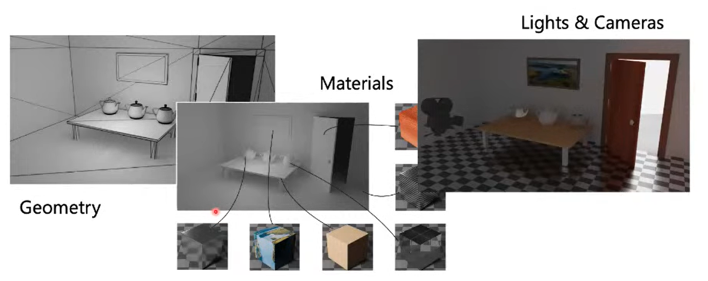
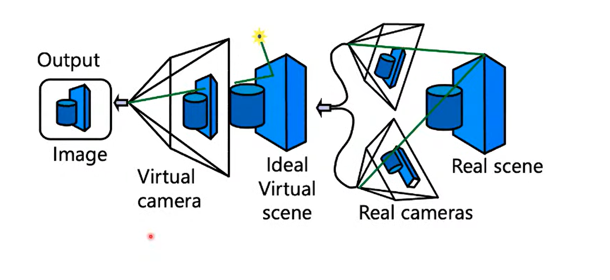
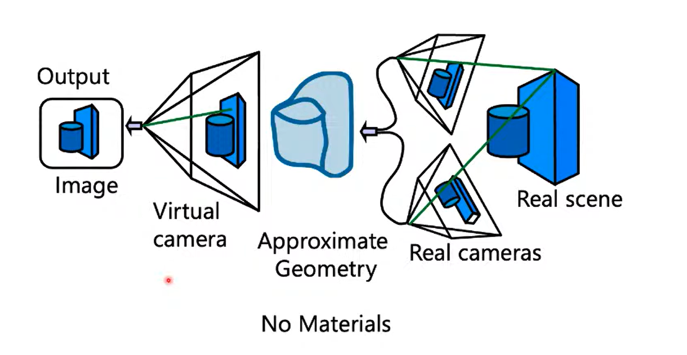
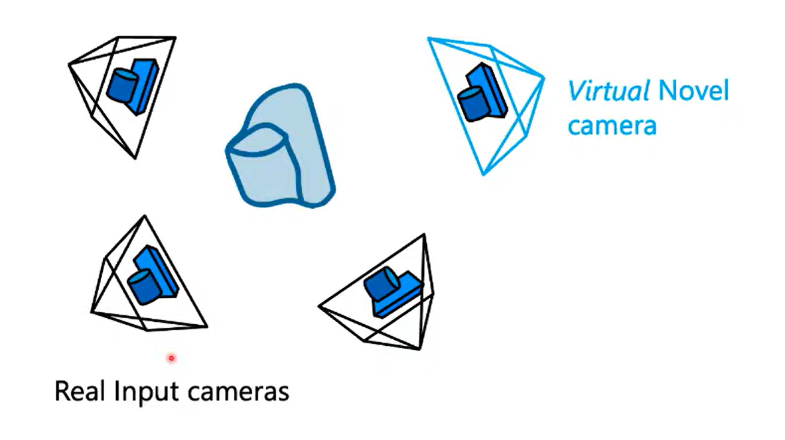
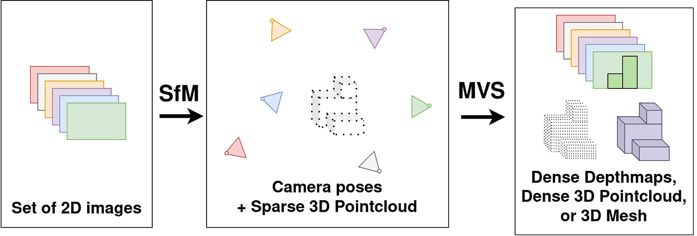
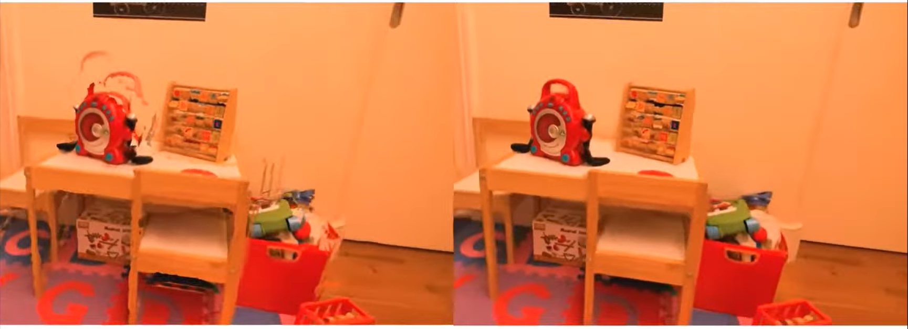

# Novel View Synthesis

The Battle of Paradigms: Neural Radiance Fields vs. 3D Gaussian Splatting

  
    Team Warm-White: Hanani Bathina | Aniket Hinge | Devesh Bajaj
  

---
layout: statement
---

# Goal

## Generate Realistic 3D Environments, allowing (real-time) navigation 

---
layout: section
---

# History

---
layout: default
---

# Physcially-based Rendering (PBR)
## Traditional approach to generate a 3D scene

**Key Steps:**

* Artists create geometry using triangular meshes

* Material is assigned to the geometry

* Cameras and Light sources are placed in the scene

* Rendering algorithms simulate light transport to give radiance to the geometry

---
layout: two-cols-header
---

# Real-World Capture & View Synthesis

::left::

## Ideal Scenario

If we had perfect geometry and camera pose estimation, we could have synthesized novel-view in this manner.

::right::

## Realistic Scenario

But, in practice, the geometry from vision is approximate and you don't have any information on material (or very hard to get)

---
layout: default
---

# Image-based Rendering (IBR)
## Bypass the need for explicit geometry and material modeling

**Key Techniques:**

* _**Light-Field Rendering**_ : Maintain a 4D light field representation and interpolate between views.

* _**View Morphing and Image Warping**_ : Use geometric transformations to morph between images.

---
layout: default
---

# Point-based Rendering
## Represent scenes using points instead of meshes

**Core Concept**:
PBR treats the scene as a dense cloud of unconnected 3D points. However, unlike meshes, it discards connectivity information (edges and faces).

**Key Techniques**:

-  **Splatting:** You cannot simply project a single dimensionless point onto a screen, or you will get a sparse image with gaps between pixels. PBR solves this via **Splatting**. Each point is treated as a small surface patch (often a disk or ellipse) called a **Surfel** (Surface Element). When rendered, these surfels are "splatted" onto the screen, overlapping each other to form a continuous surface

**Artifacts**: PBR struggled with **holes** (when you zoom in too close and the points spread apart) and **aliasing** (jagged edges). It also struggled with transparency and view-dependent effects (like reflections) because points usually hold a single fixed color.

---
layout: default
---

# SFM & MVS

**Structure from Motion (SfM)** & **Multi-View Stereo (MVS)**: automatic camera calibration and sparse/dense geometric reconstruction.

* **SfM** is a major breakthrough. It has a very useful side-product: A set of 3D points.
* **MVS** algorithms can then densify this sparse point cloud into a dense reconstruction. Prodcued good meshes overall but suffered from missing or too much geometry. 

---
layout: default
---

# Blending for IBR, Neural Networks, Deep Blending

* To generate novel view, acquire nearby images and blend them together.
* Blending weights can be learned using neural networks.
* Deep Blending uses a CNN to predict blending weights for each pixel in the nearby images:
  * Create Per-View Meshes
  * Train a CNN to predict blending weights
  * Blend reprojections of nearby views using predicted weights.
  * Deep Learning solved the (very hard) blending problem.

---
layout: default
---

# Pre-NN IBR vs Post-NN IBR

---
layout: statement
---

# The Great Epiphany

## Instead of reprojecting geometry onto 2D Screen, learn a representation which could be queried directly for rendering!

---
layout: statement
---

# The Battle of Paradigms
## Implicit Representation vs Explicit Representation

---
layout: section
---

# NeRF
## Neural Radiance Fields

---
layout: section
---

# 3DGS
## 3D Gaussian Splatting

---
layout: section
---

# Implementation

## 3D Reconstruction & Fly-Through

---
layout: iframe
url: https://playcanv.as/b/93a90ac0
---
---
layout: default
---

# Hero Shot

## Is this Video Recorded by Camera?

<video width="250" height="450" controls float="right">
  <source src="./videos/himalayan.mp4" type="video/mp4">
  Your browser does not support the video tag.
</video>

**If yes, explain how was I able to fit a camera through the narrow space between the engine and body?**

**Explain the stability of the video even when the camera is moving at high speed?**

---
layout: default
---

# NeRF Reconstruction

<video controls float="right">
  <source src="./videos/nerf_reconstruction.mp4" type="video/mp4">
  Your browser does not support the video tag.
</video>

---
layout: default
---

# 3DGS Reconstruction

<video controls>
  <source src="./videos/3dgs_reconstruction.mp4" type="video/mp4">
  Your browser does not support the video tag.
</video>

---
layout: default
---

# Human Reconstruction with Bad Input Data

<video controls>
  <source src="./videos/human_reconstruction.mp4" type="video/mp4">
  Your browser does not support the video tag.
</video>

---
layout: default
---

# Fly-Through Behind-the-Scenes

<video controls width="250" height="450">
  <source src="./videos/fly_through.mp4" type="video/mp4">
  Your browser does not support the video tag.
</video>

---
layout: default
---

# Fly-Through Behind-the-Scenes

<video controls width="250" height="450">
  <source src="./videos/fly_through.mp4" type="video/mp4">
  Your browser does not support the video tag.
</video>

---
layout: default
---

# Depth is Reconstructed too!

<video controls width="250" height="450">
  <source src="./videos/depth_map.mp4" type="video/mp4">
  Your browser does not support the video tag.
</video>

