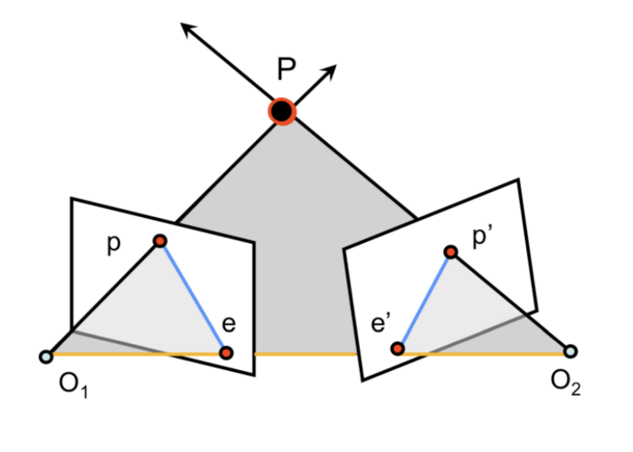
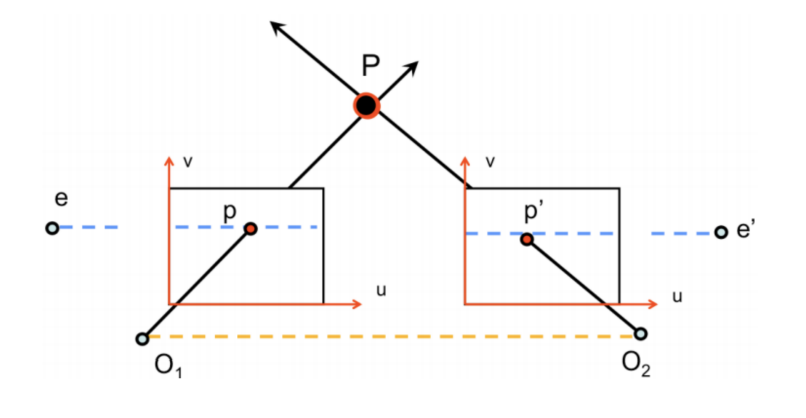
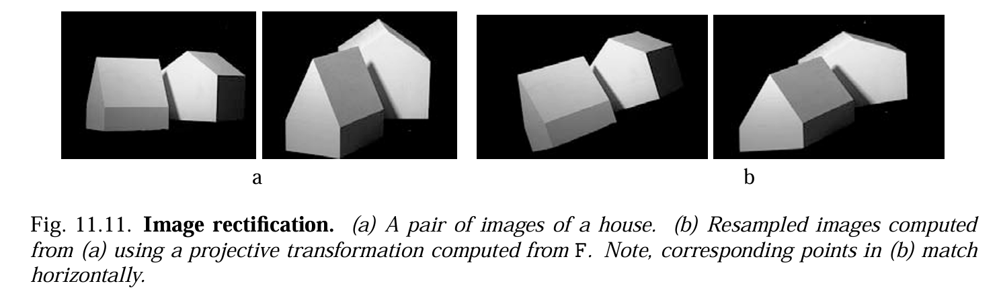
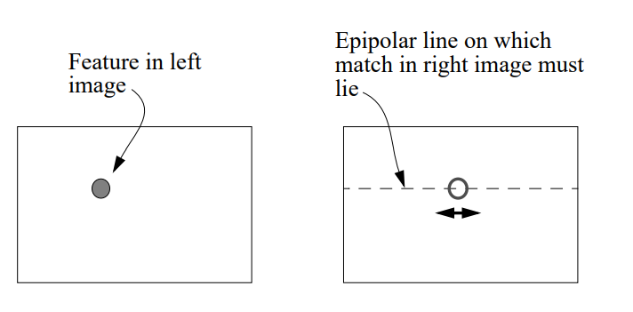
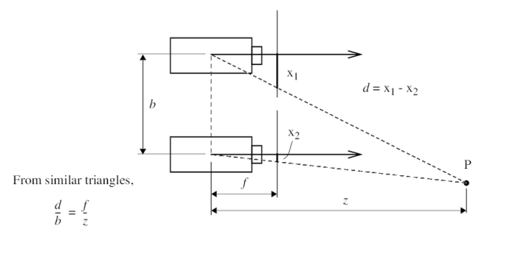

# Disparity

It's inversely proportional to depth!

  
    Hanani Bathina
  

---
layout: statement
---

# Goal

## To show that disparity is inversely proportional to depth, and derive the formula for disparity.

---
layout: center
---

# The Core Intuition

## What is Disparity?

* It is the apparent pixel shift of an object when viewed from two different vantage points.
* **Biological Analogy:** Hold a finger in front of your face. Close one eye, then the other. The finger "jumps."
* **The Inverse Relationship:**
    - Objects **close** to the camera have **large** disparity (large jump).
    - Objects **far** away have **small** disparity (small jump).
    - Objects at **infinity** have **zero** disparity.

---
layout: default
---

# Recap: Epipolar Geometry

* **The Epipolar Constraint:**
    - Given $p$, the matching point $p'$ is constrained to lie on the **epipolar line** in the right image.
    - This line is the intersection of the image plane with the epipolar plane (formed by $O_1, O_2, P$).

* **The Fundamental Matrix (F):**
    - Encapsulates this geometry algebraically: $p'^TFp=0$
      - $F$ maps a point in one image to a line in the other.

---
layout: center
---

# Image Rectification
## Simplifying Correspondence Search

- **Problem:** Epipolar lines are generally slanted, requiring a complex 2D search for matches.

- **Solution:** **Rectification**.
    - We apply a homography to warp both images such that the **epipolar lines become horizontal** and aligned (scanlines).
    - Mathematically, we map the epipoles to infinity: $e' = [1, 0, 0]^T$.

---
layout: default
---

# Image Rectification
## Result

* The corresponding point $p'$ for a pixel $(x, y)$ in the left image lies strictly on the row $y$ in the right image.
* Search reduces from **2D** $\to$ **1D**.

---
layout: default
---

# Image Rectification

## Result

* The corresponding point $p'$ for a pixel $(x, y)$ in the left image lies strictly on the row $y$ in the right image.
* Search reduces from **2D** $\to$ **1D**.

---
layout: default
---

# Image Rectification

## Simplified Correspondence Search

* The corresponding point $p'$ for a pixel $(x, y)$ in the left image lies strictly on the row $y$ in the right image.
* Search reduces from **2D** $\to$ **1D**.

---
layout: default
---

# Geometry of Disparity

**Deriving Depth from Similar Triangles**

Assuming rectified images (canonical stereo setup):

* **Baseline ($b$):** Distance between $O_1$ and $O_2$.
* **Disparity ($d$):** The shift $x_1 - x_2$.

By similar triangles:
$$\frac{z}{f} = \frac{X}{x_1} \quad \text{and} \quad \frac{z}{f} = \frac{X-b}{x_2}$$
Subtracting the two equations yields:
$$z = \frac{f \cdot b}{d}$$

> **Conclusion:** Depth $z$ is inversely proportional to disparity $d$.

---
layout: center
---

<Youtube id="1WHSZjMw7Zc" />